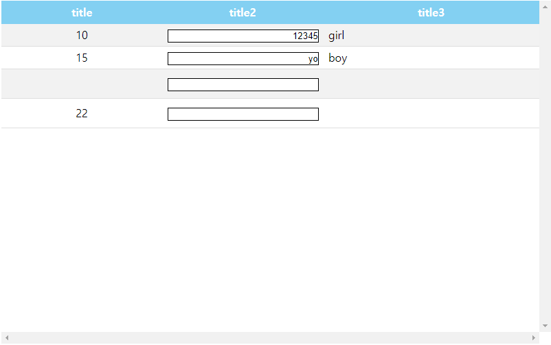

# pdsGrid
Make a grid

I'm making grid module.

# Project title

# Motivation
Grid is essential part of website and has a lot of functions. 
But I'm developing grid module having only few functions because my company needs.
I want to give experience to coworkers make grid easily.

# Build status
20180516 Support making a grid form with column and row attribute.

# Screenshots


# Tech/framework used
javascript
jQuery

# Code Example
```
  var age = [10, 15, , 22];
  var text = [12345, "yo"];
  var gender = ["girl", "boy"];

  var pdsDataSource = [
    {data: age, columnname: "title"},
    {data: text, columnname: "title2"},
    {data: gender, columnname: "title3"}
  ];

  $(document).ready(function() {
    $("#pdsGrid").pdsGrid({
      width:800,
      height:500,
      source: pdsDataSource,
      columns: [
        {text: "title", width: '30%', align: 'center'},
        {text: "title2", type: "textbox", width: '30%', align: 'right'},
        {text: "title3", align: 'left'}
      ]
    });
  });
```

# Contribute
Please give me pull request


# Attributes
* 그리드 사이즈 (width, height)
```
$(“#pdsGrid”).pdsGrid({ width: 850 });
$(“#pdsGrid”).pdsGrid({ height: 600 });
```
* 행 높이 (rowheight)
* 컬럼 (columns)
* 컬럼명 (text)
* 컬럼 타입 (columntype)
	“dropdown”, “radiobutton”, “checkbox”, “textbox”, “default”
* 셀 타입 (celltype)
		“number”, “string”
* 정렬 스타일 (align)
“left”, “center”, “right”
* DB컬럼명 (dbcolumnname)
* 데이터베이스 컬럼명은 그리드의 컬럼과 같은 이름을 가진 행에 연동된다.
* 그리드 헤더 (columnheader)
* 컬럼 사이즈  (width, height)
* 컬럼명 (columnname)
* 열/행 나누기 (열/행을 합치거나 나누고 싶을 때) (colspan, rowspan)
* 정렬 기능 (sorted)
  true, false
* 폰트 스타일 (fontcolor, fontsize, fontalign)
* 배경 색상 (bgcolor)
* 한줄 그리드 갯수 (rowgridcount)
* 한줄 그리드 갯수에 입력한 그리드 수 만큼 한 행에 그리드를 만들 수 있다.
* 선택한 row (selectedrow)
* 선택 타입 (selecttype)
  “row”, “cell”
* 홀수의 열에 스타일을 적용한다. 
* 폰트 스타일 (fontcolor, fontsize, fontalign)
* 배경 색상 (bgcolor)
* 한 면에 보여줄 수 있는 컨텐츠 수 (pagingrowsize)
* 페이징 갯수 (pagingsize)
* 비활성화 (disabled)
* 수정 (editable)
  true, false
* 합계 컬럽 (totalcolumns)
* 합계 (totalvalue)
  totalvalue([“컬럼명”,”컬럼명”])
* DB연동 (dbadapter)
* 주소 (url)
* 데이터 (data)
* 이벤트
  데이터를 가져오면 adapter 대상에 addRow 를 하며 한 줄씩 추가된다.

# functions
* 열 추가 (addcolumn)
* 행 추가 (addrow)
* 데이터가 기본 그리드 사이즈 보다 길다면 스크롤이 생긴다.
* 다음 페이지 이동 (nextpage)
* 이전 페이지 이동 (beforepage)

이벤트
DB바인딩이 완료되었을 때 (bindingcomplete)
행이 선택되었을 때 (rowselected)
데이터가 선택되었을 때 (cellclicked)
데이터 수정을 시작할 때 (begincelledit)
데이터 수정이 끝났을 때 (endcelledit)


버튼
버튼은 생성, 수정, 삭제가 있다.
생성 버튼을 누르면 기본 사이즈의 그리드가 생성된다.
저장 버튼을 누르면 현재의 데이터와 상태를 저장한다.
삭제 버튼을 누르면 그리드에 적혀졌던 모든 데이터가 삭제된다.

